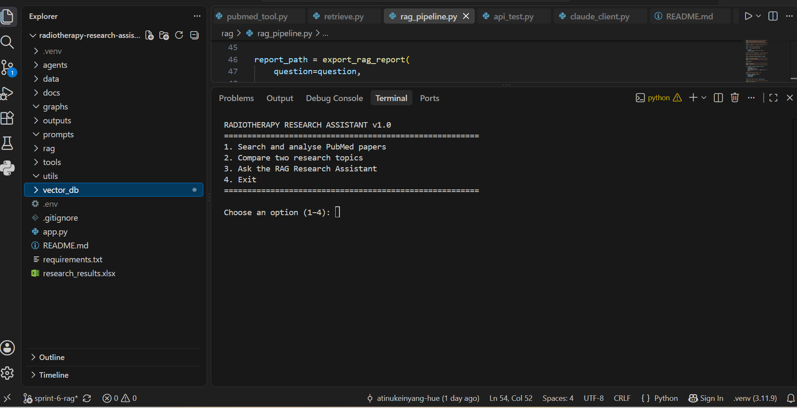
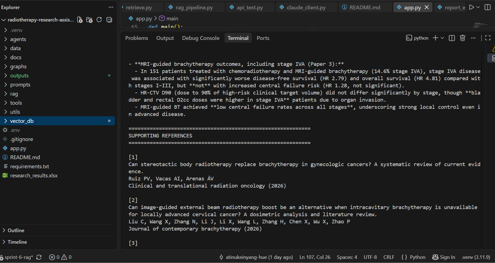
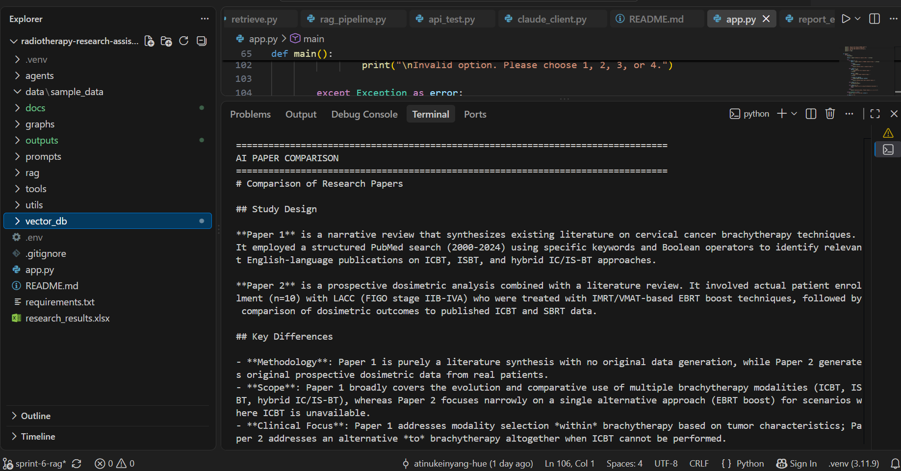
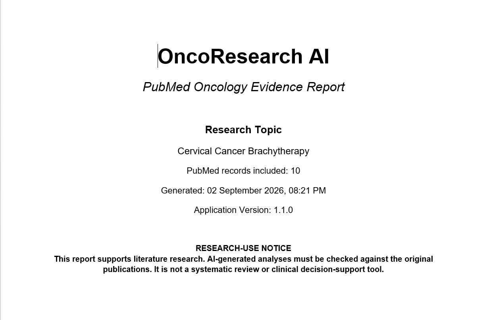

# 🩺 OncoResearch AI

      

### *An Evidence-Based AI Research Assistant for Radiotherapy and Medical Physics*

OncoResearch AI is an AI-powered **Retrieval-Augmented Generation (RAG)** research assistant designed to help clinicians, medical physicists, researchers, and students rapidly explore the scientific literature.

The application searches **PubMed**, builds a local semantic knowledge base using **ChromaDB**, retrieves the most relevant research papers, generates evidence-based answers using **Claude Sonnet**, compares scientific publications, and exports professionally formatted research reports.

---

## 🚀 Project Highlights

- 🔍 Live PubMed research search
- 🤖 AI-powered paper analysis with Claude Sonnet
- ⚖️ AI comparison of research papers
- 🧠 Retrieval-Augmented Generation (RAG)
- 📚 ChromaDB semantic vector database
- 📑 Evidence-grounded AI answers
- 📄 Professional Microsoft Word report generation
- 📊 Excel research report export
- 🖥️ Interactive menu-driven application
---

# 📸 Application Preview

## Main Menu



---

## Retrieval-Augmented Generation (RAG)



---

## AI Paper Comparison



---

## Professional Word Report



---

# 🏗️ System Architecture

The diagram below illustrates the high-level architecture of **OncoResearch AI** and how the different components work together to generate evidence-based research answers.

<p align="center">
  
</p>

---

# ⚙️ Installation

Clone the repository:

```bash
git clone https://github.com/atinukeinyang-hue/oncoresearch-ai.git
```

Navigate into the project:

```bash
cd oncoresearch-ai
```

Create a virtual environment:

```bash
python -m venv .venv
```

Activate the virtual environment.

Windows:

```bash
.venv\Scripts\activate
```

macOS/Linux:

```bash
source .venv/bin/activate
```

Install the dependencies:

```bash
pip install -r requirements.txt
```

Create a `.env` file and add your API keys:

```text
ANTHROPIC_API_KEY=your_key_here
```

Build the local vector database before running the application:

```bash
python rag/build_vector_db.py
```

---

# ▶️ Usage Guide

After installation, launch the application:

```bash
python app.py
```

You will be presented with an interactive menu:

```
1. Search and analyse PubMed papers
2. Compare two research topics
3. Ask the RAG Research Assistant
4. Exit
```

### Search and Analyse PubMed Papers

Search the latest scientific literature directly from PubMed and generate AI-assisted summaries.

### Compare Research Topics

Compare two research topics or publications and identify key similarities and differences.

### Ask the RAG Research Assistant

Ask evidence-based research questions against your local ChromaDB knowledge base.

### Export Professional Reports

Generate professionally formatted Microsoft Word research reports and Excel exports for documentation and further analysis.

---

# 📁 Project Structure

```text
oncoresearch-ai/
│
├── agents/              # AI agents for research and comparison
├── docs/                # Documentation, architecture, screenshots
├── outputs/             # Generated Word reports
├── prompts/             # Prompt templates
├── rag/                 # Retrieval-Augmented Generation pipeline
├── tools/               # PubMed, Claude, and export utilities
├── utils/               # Shared helper functions
├── vector_db/           # Local ChromaDB vector database
│
├── app.py               # Main application entry point
├── requirements.txt     # Python dependencies
├── README.md            # Project documentation
└── .env                 # Environment variables (not committed)
```

---

# 🛠️ Technologies Used

| Technology | Purpose |
|------------|---------|
| Python 3.11 | Core programming language |
| Claude Sonnet | AI reasoning and scientific analysis |
| PubMed API | Retrieval of biomedical research papers |
| ChromaDB | Local vector database for semantic search |
| Retrieval-Augmented Generation (RAG) | Evidence-grounded AI responses |
| Microsoft Word (.docx) | Professional report generation |
| Microsoft Excel (.xlsx) | Structured research export |
| VS Code | Development environment |
| Git & GitHub | Version control and collaboration |