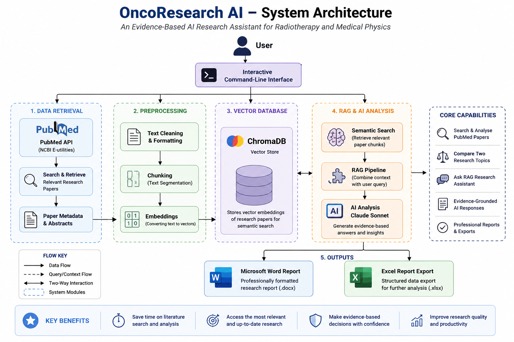

## 🩺 OncoResearch AI


> 🚧 **Project Status:** Active Development (Version 1.0)
>
> This project is actively maintained, with additional AI capabilities planned for future releases.

## *An Evidence-Based AI Research Assistant for Radiotherapy and Medical Physics*

OncoResearch AI is an AI-powered **Retrieval-Augmented Generation (RAG)** research assistant designed to help clinicians, medical physicists, researchers, and students rapidly explore the scientific literature.

The application searches **PubMed**, builds a local semantic knowledge base using **ChromaDB**, retrieves relevant research papers, generates evidence-based answers using **Claude Sonnet**, compares scientific publications, and exports professionally formatted research reports.

---

## ⚡ Quick Start

Clone the repository:

```bash
git clone https://github.com/atinukeinyang-hue/oncoresearch-ai.git
cd oncoresearch-ai
```

Create a virtual environment:

```bash
python -m venv .venv
```

Activate the virtual environment.

**Windows PowerShell:**

```powershell
.\.venv\Scripts\Activate.ps1
```

**macOS/Linux:**

```bash
source .venv/bin/activate
```

Install the dependencies:

```bash
python -m pip install -r requirements.txt
```

Create your local environment file.

**Windows PowerShell:**

```powershell
Copy-Item .env.example .env
```

**macOS/Linux:**

```bash
cp .env.example .env
```

Open `.env` and add your Anthropic API key:

```env
ANTHROPIC_API_KEY=your_anthropic_api_key_here
```

Build the local RAG knowledge base:

```bash
python rag/build_vector_db.py
```

Launch OncoResearch AI:

```bash
python app.py
```

---

## 📚 Table of Contents

- [Why OncoResearch AI?](#why-oncoresearch-ai)
- [Project Highlights](#-project-highlights)
- [Application Preview](#-application-preview)
- [System Architecture](#️-system-architecture)
- [Installation](#️-installation)
- [Usage Guide](#️-usage-guide)
- [Project Structure](#-project-structure)
- [Technologies Used](#️-technologies-used)
- [Key Skills Demonstrated](#key-skills-demonstrated)
- [Research and Education Applications](#-research-and-education-applications)
- [Roadmap](#️-roadmap)
- [Acknowledgements](#acknowledgements)
- [About the Author](#about-the-author)
- [License](#-license)

---

## Why OncoResearch AI?

Medical literature is expanding rapidly, making it increasingly difficult for clinicians, medical physicists, researchers, and students to stay current with the latest evidence.

OncoResearch AI was developed to streamline evidence-based literature exploration by combining live PubMed retrieval, AI-powered analysis, Retrieval-Augmented Generation (RAG), semantic search using ChromaDB, and automated report generation into a single research workflow.

The project demonstrates how modern AI engineering techniques can support scientific research while reducing the time required to identify, analyze, compare, and summarize relevant biomedical publications.

---

## 🚀 Project Highlights

- 🔍 Live PubMed research search
- 🤖 AI-powered paper analysis with Claude Sonnet
- ⚖️ AI comparison of research papers
- 🧠 Retrieval-Augmented Generation (RAG)
- 📚 ChromaDB semantic vector database
- 📑 Evidence-grounded AI answers
- 📄 Professional Microsoft Word report generation
- 📊 Excel research report export
- 🖥️ Interactive menu-driven application

---

## 📸 Application Preview

### Main Menu


---

### Retrieval-Augmented Generation (RAG)


---

### AI Paper Comparison


---

### Professional Word Report


---

## 🏗️ System Architecture

The diagram below illustrates the high-level architecture of **OncoResearch AI** and how the different components work together to generate evidence-based research answers.

<p align="center">
  
</p>

---

## ⚙️ Installation

Clone the repository:

```bash
git clone https://github.com/atinukeinyang-hue/oncoresearch-ai.git
```

Navigate into the project:

```bash
cd oncoresearch-ai
```

Create a virtual environment:

```bash
python -m venv .venv
```

Activate the virtual environment.

**Windows PowerShell:**

```powershell
.\.venv\Scripts\Activate.ps1
```

**macOS/Linux:**

```bash
source .venv/bin/activate
```

Install the dependencies:

```bash
python -m pip install -r requirements.txt
```

Create your local `.env` file from the provided template.

**Windows PowerShell:**

```powershell
Copy-Item .env.example .env
```

**macOS/Linux:**

```bash
cp .env.example .env
```

Open `.env` and add your Anthropic API key:

```env
ANTHROPIC_API_KEY=your_anthropic_api_key_here
```

> Keep your real `.env` file private and never commit your API key to GitHub.

Before using the **RAG Research Assistant**, build the local ChromaDB knowledge base:

```bash
python rag/build_vector_db.py
```

Launch the application:

```bash
python app.py
```

---

## ▶️ Usage Guide

After installation, launch the application:

```bash
python app.py
```

You will be presented with an interactive menu:

```text
1. Search and analyse PubMed papers
2. Compare two research topics
3. Ask the RAG Research Assistant
4. Exit
```

### Search and Analyse PubMed Papers

Search the latest scientific literature directly from PubMed and generate AI-assisted summaries.

### Compare Research Topics

Compare two research topics or publications and identify key similarities and differences.

### Ask the RAG Research Assistant

Ask evidence-based research questions against your local ChromaDB knowledge base.

If the knowledge base has not yet been initialized, run:

```bash
python rag/build_vector_db.py
```

### Export Professional Reports

Generate professionally formatted Microsoft Word research reports and Excel exports for documentation and further analysis.

---

## Example Output

```text
============================================================
Research Topic:
Cervical Cancer Brachytherapy

Searching PubMed...

Retrieved 5 papers

Generating Claude analysis...

✓ Excel report generated
✓ Word report generated

Completed successfully.
============================================================
```

---

## 📁 Project Structure

```text
oncoresearch-ai/
│
├── agents/                       # Research and comparison agents
├── docs/                         # Documentation, architecture, screenshots
├── outputs/                      # Generated research outputs
├── rag/                          # Retrieval-Augmented Generation pipeline
├── tools/                        # PubMed, Claude, and export utilities
│
├── .env.example                  # Environment variable template
├── .gitignore                    # Git ignore rules
├── LICENSE                       # MIT License
├── README.md                     # Project documentation
├── app.py                        # Main application entry point
├── requirements.txt              # Python dependencies
└── sample_research_results.xlsx  # Example research export
```

### Local runtime files

The following are created locally when the project is configured or used and are not part of the distributed source repository:

```text
.env
vector_db/
```

- `.env` stores the user's private Anthropic API key.
- `vector_db/` stores the local persistent ChromaDB knowledge base.

---

## 🛠️ Technologies Used

| Technology | Purpose |
|---|---|
| **Python 3.11** | Core programming language |
| **Claude Sonnet** | AI reasoning and scientific analysis |
| **PubMed API** | Retrieval of biomedical research papers |
| **ChromaDB** | Local vector database for semantic search |
| **Retrieval-Augmented Generation (RAG)** | Evidence-grounded AI responses |
| **Microsoft Word (.docx)** | Professional report generation |
| **Microsoft Excel (.xlsx)** | Structured research export |
| **VS Code** | Development environment |
| **Git & GitHub** | Version control and collaboration |

---

## Key Skills Demonstrated

- Python application development
- REST API integration
- Prompt engineering
- Large Language Model (LLM) integration
- Retrieval-Augmented Generation (RAG)
- ChromaDB vector databases
- Semantic search
- JSON processing
- Microsoft Word automation
- Microsoft Excel automation
- Dependency management
- Environment-variable management
- Exception handling
- Reproducible Python environments
- Git and GitHub
- Modular software architecture

---

## 🔬 Research and Education Applications

- Evidence-based literature review
- Radiotherapy research
- Medical physics research and education
- Clinical guideline literature exploration
- Research paper comparison
- AI-assisted research report generation
- Scientific knowledge retrieval

> **Note:** OncoResearch AI Version 1.0 is a research and educational tool. It is not clinically validated and is not intended for patient-specific clinical decision-making.

---

## 🗺️ Roadmap

### ✅ Version 1.0

- Live PubMed integration
- AI-powered paper summarization
- AI paper comparison
- Retrieval-Augmented Generation (RAG)
- ChromaDB semantic search
- Evidence-grounded AI responses
- Professional Microsoft Word report generation
- Excel export
- Interactive command-line application
- Professional documentation

---

### 🚀 Planned for Version 2.0

- PDF research paper upload
- Multi-LLM support
- Clinical guideline assistant
- Citation manager
- Web interface
- User authentication
- Research history
- Cloud deployment

Future capabilities will be added incrementally and documented when implemented.

---

## Acknowledgements

This project makes use of the following open-source tools and services:

- PubMed (NCBI)
- Anthropic Claude API
- ChromaDB
- OpenPyXL
- python-docx
- Python Requests

---

## About the Author

Developed by **Atinuke Inyang**.

Medical Physicist exploring AI engineering for radiotherapy, medical physics research, medical AI, and evidence-based research automation.

This project forms part of a broader portfolio focused on combining medical physics domain knowledge with Python, APIs, Retrieval-Augmented Generation (RAG), vector databases, and modern AI-assisted research workflows.

- GitHub: [atinukeinyang-hue](https://github.com/atinukeinyang-hue)
- LinkedIn: [Atinuke Inyang](https://www.linkedin.com/in/atinukeinyang/)

---

## 📄 License

This project is licensed under the **MIT License**.

You are free to use, modify, and distribute this software in accordance with the terms of the MIT License.

See the [LICENSE](LICENSE) file for details.