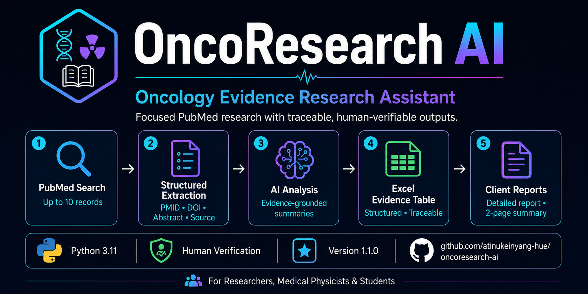

# 🩺 OncoResearch AI

<p align="center">
  
</p>


> **Project status:** Active development — Version 1.1.0

## Oncology Evidence Research Assistant

**OncoResearch AI** is a Python-based research assistant for focused oncology, radiotherapy and medical-physics literature workflows.

It retrieves PubMed records, preserves source information, produces structured AI-assisted analyses, supports semantic retrieval with ChromaDB and exports traceable Excel and Word research deliverables.

> **Research-use notice:** OncoResearch AI is intended for research and education only. It is not a systematic-review platform, full-text review service, medical device or clinical decision-support tool. AI-generated content must be verified against the original publications.

---

## 🚀 Key Features

- Retrieves up to 10 PubMed records
- Preserves PMID, DOI, PubMed URL and available abstracts
- Produces structured AI-assisted paper analysis
- Uses evidence-grounded prompts with missing-information safeguards
- Exports a professionally formatted Excel evidence table
- Generates a detailed source-traceable Word report
- Generates a concise two-page evidence summary
- Supports research-topic comparison
- Supports Retrieval-Augmented Generation
- Uses ChromaDB for local semantic retrieval
- Includes explicit human-verification warnings
- Includes automated workflow and export tests

---

## ⚡ Quick Start

```bash
git clone https://github.com/atinukeinyang-hue/oncoresearch-ai.git
cd oncoresearch-ai
python -m venv .venv
```

Activate the environment on Windows PowerShell:

```powershell
.\.venv\Scripts\Activate.ps1
```

On macOS or Linux:

```bash
source .venv/bin/activate
```

Install the dependencies:

```bash
python -m pip install -r requirements.txt
```

Create a local environment file:

```powershell
Copy-Item .env.example .env
```

Add an Anthropic API key to `.env`:

```env
ANTHROPIC_API_KEY=your_anthropic_api_key_here
```

> Never commit a real `.env` file or API key to GitHub.

Launch the application:

```bash
python app.py
```

---

## ▶️ Main Workflows

### PubMed search and analysis

The workflow retrieves up to 10 PubMed records, extracts traceable metadata, performs structured AI-assisted analysis and generates Excel and Word outputs.

Example query:

```text
MRI-guided brachytherapy outcomes for locally advanced cervical cancer
```

### Research-topic comparison

The comparison workflow retrieves literature for two topics and generates an AI-assisted comparison of the available evidence.

### RAG Research Assistant

The RAG workflow retrieves relevant records from a local ChromaDB collection and supplies them as context for evidence-grounded answers.

Build the local knowledge base before using RAG:

```bash
python rag/build_vector_db.py
```

---

## 📦 Research Outputs

### Excel evidence table

The Excel workbook includes PMID, DOI, clickable PubMed URL, title, authors, journal, year, abstract, study design, key findings, clinical significance, limitations, keywords and verification status.

### Detailed Word report

The detailed report includes article metadata, PMID, DOI, clickable PubMed sources, available abstracts, structured AI-assisted analyses and verification warnings.

### Concise evidence summary

The two-page client summary includes the research topic, evidence overview, main patterns, clinical relevance, evidence limitations, cautious conclusion, included PMIDs and a research-use disclaimer.

---

## 📸 Application Preview

### Main Menu


### Retrieval-Augmented Generation


### AI Paper Comparison


### Professional Word Report


---

## 🏗️ System Architecture

```text
Research question
        |
        v
PubMed ESearch and EFetch
        |
        v
Structured metadata extraction
        |
        v
Evidence-grounded AI analysis
        |
        +-- Excel evidence table
        +-- Detailed Word report
        +-- Concise evidence summary
        |
        v
Human verification against original sources
```


---

## 🧪 Testing

```bash
python -m pytest -v
```

Current verified result:

```text
2 passed
```

The tests use simulated records and do not contact PubMed or Claude. They verify that each exporter runs once and that the Excel output preserves required traceability fields and clickable source links.

---

## 📁 Project Structure

```text
oncoresearch-ai/
├── agents/
├── docs/
├── outputs/
├── rag/
├── tests/
│   └── test_research_workflow.py
├── tools/
├── .env.example
├── .gitignore
├── app.py
├── LICENSE
├── README.md
├── requirements.txt
└── sample_research_results.xlsx
```

---

## 🛠️ Technologies

| Technology | Purpose |
|---|---|
| Python 3.11 | Core application |
| NCBI PubMed E-utilities | Literature retrieval |
| Anthropic Claude Sonnet | AI-assisted analysis and synthesis |
| ChromaDB | Vector storage and semantic retrieval |
| Requests | API communication |
| XML ElementTree | PubMed XML processing |
| OpenPyXL | Excel evidence-table generation |
| python-docx | Word report generation |
| pytest | Automated testing |
| Git and GitHub | Version control |

---

## ⚠️ Limitations and Responsible Use

OncoResearch AI currently:

- Searches PubMed only
- Uses PubMed records and available abstracts
- Does not guarantee access to complete articles
- Does not conduct an exhaustive systematic search
- Requires manual relevance screening
- Does not perform formal risk-of-bias assessment
- May produce inaccurate AI-generated interpretations
- Must not be used for patient-specific clinical decisions

Users are responsible for checking article relevance, numerical findings, study design, citations and conclusions against the original publications.

---

## 🗺️ Release History

### Version 1.0

- Live PubMed retrieval
- AI-assisted paper analysis
- Research-topic comparison
- Retrieval-Augmented Generation
- ChromaDB semantic retrieval
- Excel and Word export
- Command-line interface

### Version 1.0.1

- Dependency and environment improvements
- Improved RAG initialization handling
- Clean-environment verification
- Documentation and generated-output cleanup

### Version 1.1.0

- Retrieval of up to 10 PubMed records
- PMID, DOI and PubMed source preservation
- Available abstract preservation
- Safer evidence-grounded AI instructions
- Human-verification statuses
- Professionally formatted Excel evidence table
- Detailed source-traceable Word report
- Concise two-page evidence summary
- Safer handling of missing abstracts
- Automated workflow and export tests

---

## 🔭 Planned Development

- Configurable search limits and date filters
- Stronger relevance screening
- Duplicate-record detection
- Search-strategy documentation
- Additional biomedical and African research sources
- Citation-manager export
- Permitted full-text ingestion
- Multi-LLM support
- Web interface
- Docker and cloud deployment

---

## 👩🏽‍💻 About the Author

Developed by **Atinuke Inyang**.

Medical Physicist and Assistant Lecturer exploring responsible applications of Python and artificial intelligence in radiotherapy, oncology research, medical physics and evidence automation.

- [GitHub](https://github.com/atinukeinyang-hue)
- [LinkedIn](https://www.linkedin.com/in/atinukeinyang/)

---

## 🙏 Acknowledgements

OncoResearch AI uses NCBI PubMed, Anthropic Claude, ChromaDB, Requests, OpenPyXL, python-docx and pytest.

---

## 📄 License

This project is licensed under the **MIT License**. See [LICENSE](LICENSE) for details.

---

⭐ **If you find OncoResearch AI useful or interesting, consider starring the repository.**
